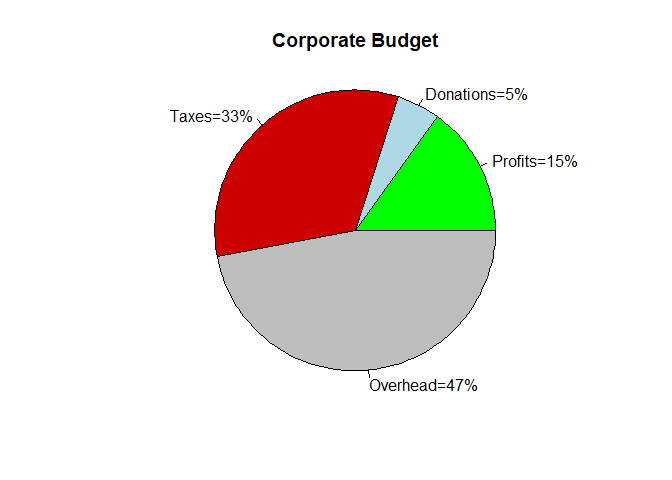

Making figures in R
================
Ricardo A DeMoya
6/21/2023

# Plotting the data

One of the most powerful parts of R besides the stats and packages is
the ability to meaningfully plot data and show others what we see. There
are many packages that can be used in R to plot data and the goal of
this tutorial is to go over a few to get started making publication
quality figures.

## Plotting with base R no packages

In R there are base functions, those that come with R without the need
to upload any packages. Since R is a statistical package it of course
comes with its own plotting functions to reveal data patterns of
interest. Here we will plot some synthetic data using base R only no
packages.

## Histograms and density plots

First we will make some synthetic data to play with using `rnorm()`. We
will use `set.seed()` to set the random generator starting point, this
will make the randomness reproducible and should only be used to teach
debug code involving random numbers. This will generate a random normal
distribution with the mean and standard deviation chosen. Then we plot
the histogram with `hist()`.

``` r
set.seed(543)
my_var <- rnorm(n = 3000,mean = 0,sd = 5)
histo <- hist(my_var,breaks = 40)
```

<!-- -->

Now we will spice it up a bit and add colors to the tails. This would be
a great way to highlight these data in a distribution of p-values for
example. To accomplish this we need to create the histogram but not
print it and then we can access the object created and use a conditional
statement to create our colored ends to then plot using the `plot()`
function.

``` r
histo2 <- hist(my_var,breaks = 40, plot = F)
tail_colors <- ifelse(histo2$breaks <= -5, "orange" ,
                      ifelse (histo2$breaks >=5, "purple","lightblue"))
plot(histo2, col=tail_colors , main="Two tail barplot" , xlim=c(-20,20))
```

<!-- -->

### Mirrored histogram

Now we will make a mirrored histogram, great for visually comparing the
distributions of two datasets. We are using a new function here `par()`.
This is a graphics function that controls graphical parameters like
margins, background, size of text labels and much more. The `mfrow`
parameter controls the layout of the graphs plotted by (number of rows,
number of columns), this giving us two rows and one column. Next we use
the `mar` parameter to set the margins on each plot so they do not
overlap.

``` r
set.seed(567)
x1 = rnorm(n=1000,mean = 0)
x2 = rnorm(n=1500,mean = 2)
par(mfrow=c(2,1))
 
#Make the plot
par(mar=c(0,5,3,3))
hist(x1, main="", xlim=c(-2,5), ylab="Frequency for\n x1", xlab="",
     xaxt="n", las=1, col="green4", breaks=15)
par(mar=c(5,5,0,3))
hist(x2, main="", xlim=c(-2,5), ylab="Frequency for\n x2",
     xlab="Variable", ylim=c(350,0), las=1, col="blue4", breaks=10)
```

<!-- -->

### Density plots

Here we can use the `density()` function to estimate the kernel density
of a dataset. We can reuse the `my_var` variable we made previously.

``` r
dens <- density(my_var,bw = "sj")
plot(dens, main = "Density Plot",col="green",frame=F)
```

<!-- -->

Then we can add color beneath the line graph generated for the density.

``` r
plot(dens, main = "Density Plot",frame=F)
polygon(dens,col="lightblue",border = "green")
```

<!-- -->

## Boxplots and Barplots

### Boxplots

Box and whisker plots can be made with the base R `boxplot()` function.
Here we make a example dataset. We can use box plots to understand the
mean differences between groups. Then we can calculate the p-values
between each group using an ANOVA method, `aov()`.

``` r
set.seed(123)
names <- c(rep("X", 80), rep("Y", 50), rep("Z", 70))
value <- c( rnorm(80, mean=10, sd=9) , rnorm(50, mean=8, sd=15),
            rnorm(70, mean=30, sd=10))
data <- data.frame(names,value)

# Perform ANOVA and extract the p-value
anova_result <- aov(value ~ names, data = data)
p_value_anova <- summary(anova_result)[[1]]$`Pr(>F)`[1]
pvals <- TukeyHSD(anova_result)
pvals <- data.frame(pvals[[1]])
 
# Basic boxplot
boxplot(data$value ~ data$names , col=topo.colors(4),
        xlab = "Values",ylab = "Names",ylim=c(-40,70))
text(x=1.5,y = 45,labels="ns")
segments(1,40,2,40)
text(x=2.5,y = 59,labels="***")
segments(2,56,3,56)
```

<!-- -->

### Barplots

Here we make some random data and plot using the `barplot()` function.
The example is supposed to represent an experiment measuring geneX
expression for three different mouse strains when treated with two
different inhibitors.

``` r
# Data
treatment_data <- data.frame(
  name = c("C57BL/6","inhibit1","inhibit2","1+2" ,"CD-1",
           "inhibit1","inhibit2","1+2" ,"SCID","inhibit1","inhibit2","1+2"),
  average = sample(seq(1,19) , 12 , replace=T),
  number = sample(seq(4,59) , 12 , replace=T))

# Make room in the bottom margin
par(mar=c(6,5,4,4),xpd=TRUE)


# Basic Barplot
my_bar <- barplot(treatment_data$average, border=F, names.arg=treatment_data$name, 
                  las=2,
                  col=c("blue2","red","yellow","orange"),
                  ylim=c(0,20),
                  main="",
                  ylab="Relative Expression\nGeneX")


segments(4.9,0,4.9,20,col="grey")
segments(9.7,0,9.7,20, col = "grey")
text(my_bar, treatment_data$average+0.7, paste("n: ",treatment_data$number, sep=""),cex=1) 
 
legend("top", legend = c("Untreated","Inhibitor 1","Inhibitor 2","Inhibitor 1+2"), 
     col = c("blue2","red","yellow","orange"), 
     bty = "n", pch=20 , pt.cex = 2, cex = 0.8, horiz = T,inset=c(-0.2,-0.2))
```

<!-- -->

## Pie charts

Next we use the `pie()` function to plot the expenses of an imaginary
business. Something that would be quickly understood by anyone in the
room and informative enough to spark discussion, like should we reduce
donations since they make up a fourth of our profits.

``` r
df <- data.frame(
  group = c("Profits", "Donations", "Taxes", "Overhead"),
  prop = c(15,5,33,47)
  )

# Create labels
pie_labels <- paste0(df$group, "=", df$prop, "%")
# Choose colors for the chart
pie_colors <- c("green","lightblue","red3","grey")

pie(df$prop, labels = pie_labels,col = pie_colors, radius = 1,main = "Corporate Budget")
```

<!-- -->

There are even more base plots in R that can be used including the
`qqnorm()`, `curve()`, and `stripchart()`. These base R plots are great
but next we will look into a very powerful R package for plotting
`ggplot2`.

## Beautiful reproducible plots with `ggplot2`

Here we will make a few figures using a `ggplot2`, a powerful package
for making publication quality figures. First we will need some data to
play with,the `datasets` library should do, and then we can explore some
data using `ggplot2`.

``` r
library("datasets")
library("ggplot2")
```

To do this effectively we will try and look at 2-3 datasets that have
interesting data that we need to find a way to present to an average
audience. This is a great real world example of what you would want to
do for a job or school work.

``` r
sleep_data <- sleep
```

The sleep data will be our first study to understand, because sleep is
sooooo important!! It is student sleep data as described by the datasets
package, but lets see what data they have collected. This can be
accomplished by viewing the column and row names usually. Here the row
names are just the index of the rows.

``` r
colNames <- colnames(sleep_data)
rowNames <- rownames(sleep_data)

colNames
```

    ## [1] "extra" "group" "ID"

``` r
rowNames
```

    ##  [1] "1"  "2"  "3"  "4"  "5"  "6"  "7"  "8"  "9"  "10" "11" "12" "13" "14" "15"
    ## [16] "16" "17" "18" "19" "20"

We can look up what these column names actually mean for this dataset,
which is testing two drugs to see the influence on sleep. The `extra`
column is the extra sleep the patients got vs control patients. The
`group` column separates the drugs used and the `ID` column is of course
for an ID for each patient. So now you need to come up with a way to
look at this data to answer certain questions made by you or your boss.
One good question is how much on average extra sleep did patients get
for each group/drug treatment?

First we plot the data to see the trends between drug group 1 and 2. A
`geom_boxplot()` from `ggplot2` works well to show an overview of the
data. Here we will also add the pvalue using the `ggprism` package
`add_pvalue()` function.

``` r
library(ggprism)
# reshaping the data for t test
sleep2 <- reshape(sleep, direction = "wide",
                  idvar = "ID", timevar = "group")

# Paired t test for pvalue
ttest_result <- t.test(Pair(extra.1, extra.2) ~ 1, data = sleep2)

df_pval <- data.frame(
  group1 = "1",
  group2 = "2",
  label = round(ttest_result$p.value,3),
  y.position = 5.75)

ggplot(sleep_data, aes(x=group, y=extra))+
  geom_boxplot(width = 0.5)+
  xlab("Drug Group")+ylab("Extra Hours of Sleep")+#Setting the axis titles
  add_pvalue(df_pval)
```

<!-- -->

Or we can do this with a combination plot to show the spread of the data
with a violin plot and the minimum, first quartile, median, third
quartile, and maximum with a box plot at once. And as you can see we
have added a few upgrades to the plot changing colors and adjusting the
plot title position using `theme()`, but we will cover that more closer
to the end of this tutorial.

``` r
ggplot(sleep_data, aes(x=group, y=extra))+
  geom_violin(width=0.8,aes(fill=group))+
  geom_boxplot(width = 0.1, color="purple4",fill = "purple", alpha =0.4)+
  scale_fill_brewer(palette ="Spectral")+
  xlab("Drug Group")+ylab("Extra Hours of Sleep")+
  ggtitle("Student Sleep Study")+labs(fill="Treatments")+ 
  theme(plot.title = element_text(hjust = 0.5))+ #Adjusts the title to center of graph
  add_pvalue(df_pval)
```

<!-- -->

And now that we have a few plots to see the data. It is clear that
group/drug 1 do not provide as much of a benefit to sleep with a median
close to 0hrs while group/drug 2 has a median closer to 2hrs of sleep.
The pvalue lower than 0.05 would also suggest the difference is
significant between the two groups. The sleep dataset is fairly simple
and doesn’t require any extra sorting or data cleaning, so let’s move
onto something a little more complex and challenging.

## A better dataset

Another dataset that contains the daily air quality measurements in New
York from May to September in 1973. This dataset is missing some Ozone
and solar radiation (Solar.R) values. What to do when data has missing
values is a debated topic. Some users just remove the data with missing
values and others will imputate to replace the data with the median or
mean of the column as this should have little influence on downstream
analyses. Here we will try removing the `NAs` and doing mean imputation
and see how it changes the plots of the data.

``` r
air <- data.frame(airquality)
head(air)
```

    ##   Ozone Solar.R Wind Temp Month Day
    ## 1    41     190  7.4   67     5   1
    ## 2    36     118  8.0   72     5   2
    ## 3    12     149 12.6   74     5   3
    ## 4    18     313 11.5   62     5   4
    ## 5    NA      NA 14.3   56     5   5
    ## 6    28      NA 14.9   66     5   6

To understand the data the structure and size you should check the
dimensions. This shows us we have 153 rows and 6 columns.

``` r
dim(air)
```

    ## [1] 153   6

### Data removal for `NAs`

Here we make some `cleanAir`. Removing all rows that contain any `NA`
values. This takes us down to just 111 rows out of the original 153.

``` r
cleanAir <- na.omit(air) # Removes rows with NA in all columns
dim(cleanAir)
```

    ## [1] 111   6

### Quick graph to see the data

First we take the month column and rename them the actual months and set
it as a factor for plotting.

``` r
cleanAir$Month[cleanAir$Month == 5]<- "May"
cleanAir$Month[cleanAir$Month == 6]<- "June"
cleanAir$Month[cleanAir$Month == 7]<- "July"
cleanAir$Month[cleanAir$Month == 8]<- "August"
cleanAir$Month[cleanAir$Month == 9]<- "September"

cleanAir$Month<-factor(cleanAir$Month,
                         levels=c("May", "June", "July", "August", "September"))
```

Now we plot some of the values by month to look for interesting trends.
It is also good practice to look for expected trends to confirm the data
is what you expected and can be trusted. We can use a combination plot
to see what the differences between each month are.

``` r
OPlot <- ggplot(cleanAir, aes(x=Month,y=Ozone,fill=Month))+
  geom_violin(width=1)+
  geom_boxplot(width=0.2,outliers = T, outlier.color = "red",outlier.shape = 8)+
  scale_fill_discrete(name = "Month",
                      labels = c("May", "June", "July", "August", "September"))
OPlot
```

<!-- -->

``` r
tempPlot <- ggplot(cleanAir, aes(x=Month,y=Temp,fill=Month))+
  geom_violin(width=1)+
  geom_boxplot(width=0.2,outliers = T, outlier.color = "red",outlier.shape = 8)+
  scale_fill_discrete(name = "Month",
                      labels = c("May", "June", "July", "August", "September"))
tempPlot
```

<!-- -->

``` r
windPlot <- ggplot(cleanAir, aes(x=Month,y=Wind,fill=Month))+
  geom_violin(width=1)+
  geom_boxplot(width=0.2,outliers = T, outlier.color = "red",outlier.shape = 8)+
  scale_fill_discrete(name = "Month",
                      labels = c("May", "June", "July", "August", "September"))
windPlot
```

<!-- -->

``` r
radPlot <- ggplot(cleanAir, aes(x=Month,y=Solar.R,fill=Month))+
  geom_violin(width=1)+
  geom_boxplot(width=0.2,outliers = T, outlier.color = "red",outlier.shape = 8)+
  scale_fill_discrete(name = "Month",
                      labels = c("May", "June", "July", "August", "September"))
radPlot
```

<!-- -->

``` r
temppoint <- ggplot(cleanAir, aes(x=Temp,y=Solar.R,fill=Month))+
  geom_point(shape = 21, size = 3,alpha=0.4)+
  scale_fill_discrete(name = "Month",
                      labels = c("May", "June", "July", "August", "September"))
temppoint
```

<!-- -->

``` r
ozonepoint <- ggplot(cleanAir, aes(x=Ozone,y=Solar.R,fill=Month))+
  geom_point(shape = 21, size = 3,alpha=0.4)+
  scale_fill_discrete(name = "Month",
                      labels = c("May", "June", "July", "August", "September"))
ozonepoint
```

<!-- -->

### Mean imputation for `NA` data

``` r
cleanAir_mean <- air
cleanAir_mean$Ozone[is.na(cleanAir_mean$Ozone)] <- mean(cleanAir_mean$Ozone,
                                                        na.rm = TRUE)
cleanAir_mean$Solar.R[is.na(cleanAir_mean$Solar.R)] <- mean(cleanAir_mean$Solar.R,
                                                            na.rm = TRUE)

cleanAir_mean$Month[cleanAir_mean$Month == 5]<- "May"
cleanAir_mean$Month[cleanAir_mean$Month == 6]<- "June"
cleanAir_mean$Month[cleanAir_mean$Month == 7]<- "July"
cleanAir_mean$Month[cleanAir_mean$Month == 8]<- "August"
cleanAir_mean$Month[cleanAir_mean$Month == 9]<- "September"

cleanAir_mean$Month<-factor(cleanAir_mean$Month,
                         levels=c("May", "June", "July", "August", "September"))
```

Now we have replaced the `NA` values in the dataset with the mean value
of that column. So we plot Ozone per month and see that when the `NAs`
are replaced it changes the plot, reducing variability between months.
There were only 37/153 (~24%) `NAs` in the Ozone column but this change
had a large influence on the plot.

``` r
OPlot_mean <- ggplot(cleanAir_mean, aes(x=Month,y=Ozone,fill=Month))+
  geom_violin(width=0.6)+
  geom_boxplot(width=0.1,outliers = T, outlier.color = "red",outlier.shape = 8)+
  scale_fill_discrete(name = "Month",
                      labels = c("May", "June", "July", "August", "September"))
OPlot
OPlot_mean
```


The only other column that also had `NAs` was the Solar.R column which
had 7/153 (~5%) values replaced. This did not have a huge influence on
the plot. Still you can see a clear difference in the bellies of the
violin plots in May and June.

``` r
radPlot_mean <- ggplot(cleanAir_mean, aes(x=Month,y=Solar.R,fill=Month))+
  geom_violin(width=1)+
  geom_boxplot(width=0.2,outliers = T, outlier.color = "red",outlier.shape = 8)+
  scale_fill_discrete(name = "Month",
                      labels = c("May", "June", "July", "August", "September"))
radPlot
radPlot_mean
```


A scatter plot illustrates the loss of data when we remove all `NA` rows
vs replace them with the mean.

``` r
temppoint_mean <- ggplot(cleanAir_mean, aes(x=Temp,y=Solar.R,fill=Month))+
  geom_point(shape = 21, size = 3,alpha=0.4)+
  scale_fill_discrete(name = "Month",
                      labels = c("May", "June", "July", "August", "September"))
temppoint
temppoint_mean
```


## A bigger dataset

We used a dataset from kaggle.com you can find it
(here)\[<https://www.kaggle.com/datasets/soylevbeytullah/ds4work-human-resources/data>\]

``` r
hrdat <- read.csv("data/Human_Resources.csv",header = T)
head(hrdat)
```

    ##   Age Attrition    BusinessTravel DailyRate             Department
    ## 1  41       Yes     Travel_Rarely      1102                  Sales
    ## 2  49        No Travel_Frequently       279 Research & Development
    ## 3  37       Yes     Travel_Rarely      1373 Research & Development
    ## 4  33        No Travel_Frequently      1392 Research & Development
    ## 5  27        No     Travel_Rarely       591 Research & Development
    ## 6  32        No Travel_Frequently      1005 Research & Development
    ##   DistanceFromHome Education EducationField EmployeeCount EmployeeNumber
    ## 1                1         2  Life Sciences             1              1
    ## 2                8         1  Life Sciences             1              2
    ## 3                2         2          Other             1              4
    ## 4                3         4  Life Sciences             1              5
    ## 5                2         1        Medical             1              7
    ## 6                2         2  Life Sciences             1              8
    ##   EnvironmentSatisfaction Gender HourlyRate JobInvolvement JobLevel
    ## 1                       2 Female         94              3        2
    ## 2                       3   Male         61              2        2
    ## 3                       4   Male         92              2        1
    ## 4                       4 Female         56              3        1
    ## 5                       1   Male         40              3        1
    ## 6                       4   Male         79              3        1
    ##                 JobRole JobSatisfaction MaritalStatus MonthlyIncome MonthlyRate
    ## 1       Sales Executive               4        Single          5993       19479
    ## 2    Research Scientist               2       Married          5130       24907
    ## 3 Laboratory Technician               3        Single          2090        2396
    ## 4    Research Scientist               3       Married          2909       23159
    ## 5 Laboratory Technician               2       Married          3468       16632
    ## 6 Laboratory Technician               4        Single          3068       11864
    ##   NumCompaniesWorked Over18 OverTime PercentSalaryHike PerformanceRating
    ## 1                  8      Y      Yes                11                 3
    ## 2                  1      Y       No                23                 4
    ## 3                  6      Y      Yes                15                 3
    ## 4                  1      Y      Yes                11                 3
    ## 5                  9      Y       No                12                 3
    ## 6                  0      Y       No                13                 3
    ##   RelationshipSatisfaction StandardHours StockOptionLevel TotalWorkingYears
    ## 1                        1            80                0                 8
    ## 2                        4            80                1                10
    ## 3                        2            80                0                 7
    ## 4                        3            80                0                 8
    ## 5                        4            80                1                 6
    ## 6                        3            80                0                 8
    ##   TrainingTimesLastYear WorkLifeBalance YearsAtCompany YearsInCurrentRole
    ## 1                     0               1              6                  4
    ## 2                     3               3             10                  7
    ## 3                     3               3              0                  0
    ## 4                     3               3              8                  7
    ## 5                     3               3              2                  2
    ## 6                     2               2              7                  7
    ##   YearsSinceLastPromotion YearsWithCurrManager
    ## 1                       0                    5
    ## 2                       1                    7
    ## 3                       0                    0
    ## 4                       3                    0
    ## 5                       2                    2
    ## 6                       3                    6

``` r
dim(hrdat)
```

    ## [1] 1470   35

This dataset is large and we should probably try to understand the 35
columns and what they mean.First we can checkout the column names and
check the data types for all the columns with `sapply()`.

``` r
sapply(hrdat, typeof,simplify="matrix")
```

    ##                      Age                Attrition           BusinessTravel 
    ##                "integer"              "character"              "character" 
    ##                DailyRate               Department         DistanceFromHome 
    ##                "integer"              "character"                "integer" 
    ##                Education           EducationField            EmployeeCount 
    ##                "integer"              "character"                "integer" 
    ##           EmployeeNumber  EnvironmentSatisfaction                   Gender 
    ##                "integer"                "integer"              "character" 
    ##               HourlyRate           JobInvolvement                 JobLevel 
    ##                "integer"                "integer"                "integer" 
    ##                  JobRole          JobSatisfaction            MaritalStatus 
    ##              "character"                "integer"              "character" 
    ##            MonthlyIncome              MonthlyRate       NumCompaniesWorked 
    ##                "integer"                "integer"                "integer" 
    ##                   Over18                 OverTime        PercentSalaryHike 
    ##              "character"              "character"                "integer" 
    ##        PerformanceRating RelationshipSatisfaction            StandardHours 
    ##                "integer"                "integer"                "integer" 
    ##         StockOptionLevel        TotalWorkingYears    TrainingTimesLastYear 
    ##                "integer"                "integer"                "integer" 
    ##          WorkLifeBalance           YearsAtCompany       YearsInCurrentRole 
    ##                "integer"                "integer"                "integer" 
    ##  YearsSinceLastPromotion     YearsWithCurrManager 
    ##                "integer"                "integer"

Some of the columns are described below, these will be ordinal data.
Those columns with characters are most likely categorical data and the
rest will be values recorded or measured meaning continuous data. This
will be important to what statistical tests and plotting we perform
below.

- Education: 1=Below College, 2=College, 3=Bachelor, 4=Master, 5=Doctor

- EnvironmentSatisfaction: 1=Low, 2=Medium, 3=High, 4=Very High

- JobInvolvement: 1=Low, 2=Medium, 3=High, 4=Very High

- JobSatisfaction: 1=Low, 2=Medium, 3=High, 4=Very High

- PerformanceRating: 1=Low, 2=Good, 3=Excellent, 4=Outstanding

- RelationshipSatisfaction: 1=Low, 2=Medium, 3=High, 4=Very High

- WorkLifeBalance: 1=Bad, 2=Good, 3=Better, 4=Best

- Attrition: 0=Stayed, 1=Left

### Asking questions of our data

We have an interesting data set here we can try to answer some
questions. What does life balance correlate with? Do higher salaries
correlate with high retention rates? Do performance ratings correlate
with better salaries? We can investigate this by calculating
R<sup>2</sup> values for two continuous variables or use spearman’s or
polyserial correlations.

To calculate the R<sup>2</sup> value you can use the `lm()` function
stands for linear model and `summary()`.

``` r
model <- lm(MonthlyRate ~ DailyRate, data = hrdat)
modelSum <- summary(model)
modelSum$r.squared
```

    ## [1] 0.001035655

Then we can use Spearman’s correlation for ordinal and continuous data
comparisons.

``` r
corre <- cor(as.numeric(hrdat$WorkLifeBalance),as.numeric(hrdat$Education),
             method ="spearman")
corre
```

    ## [1] 0.01735044

``` r
corre2 <- cor(as.numeric(hrdat$WorkLifeBalance),hrdat$MonthlyIncome,
              method ="spearman")
corre2
```

    ## [1] 0.03075915

``` r
corre3 <- cor(as.numeric(hrdat$WorkLifeBalance),hrdat$YearsInCurrentRole,
              method ="spearman")
corre3
```

    ## [1] 0.02321426

There is a positive weak monotonic relationship between work life
balance and education, monthly income, and years in the current role.

Another test for ordinal and continuous data is the polyserial
correlation instead of Spearman’s. The polyserial correlation value
assumes an underlying bivariate normal distribution for a latent
continuous variable that the ordinal variable represents. But still only
a weak correlation between monthly income and work life balance. I guess
it is true money can not buy happiness.

``` r
# install.packages("polycor")
library(polycor)

# x=ordinal_var y=continuous_var
polyserial(hrdat$MonthlyIncome,hrdat$WorkLifeBalance)
```

    ## [1] 0.03426368

Making the work life balance column a factor with levels and changing
the values for plotting.

``` r
hrdat$WorkLifeBalance[hrdat$WorkLifeBalance == 1]<- "Bad"
hrdat$WorkLifeBalance[hrdat$WorkLifeBalance == 2]<- "Good"
hrdat$WorkLifeBalance[hrdat$WorkLifeBalance == 3]<- "Better"
hrdat$WorkLifeBalance[hrdat$WorkLifeBalance == 4]<- "Best"

hrdat$WorkLifeBalance<-factor(hrdat$WorkLifeBalance,
                         levels=c("Bad", "Good", "Better", "Best"))
```

``` r
ggplot(hrdat, aes(x=WorkLifeBalance,y=MonthlyIncome,fill=WorkLifeBalance))+
  geom_violin(alpha=0.4)
```

<!-- -->

``` r
ggplot(hrdat, aes(x=WorkLifeBalance,y=Education,fill=WorkLifeBalance))+
  geom_violin(width=0.8,alpha=0.4)+
  geom_boxplot(width=0.15)+
  scale_fill_discrete(name = "Work Life\nBalance",
                      labels = c("Bad", "Good", "Better", "Best"))
```

<!-- -->

``` r
ggplot(hrdat, aes(x=MonthlyIncome,y=YearsAtCompany,colour = WorkLifeBalance))+
  geom_point(alpha=0.5)+
  stat_smooth(aes(fill=WorkLifeBalance),se=T,show.legend = F,
              formula = 'y ~ x')+
  scale_color_discrete(name = "Work Life\nBalance", 
                       labels = c("Bad", "Good", "Better", "Best"),
                       palette = c("red","yellow","green","purple"))
```

<!-- -->

``` r
ggplot(hrdat, aes(x=WorkLifeBalance,y=DistanceFromHome,fill=WorkLifeBalance))+
  geom_violin(width=0.8)+
  geom_boxplot(width = 0.15, color="grey",fill = "brown", alpha =0.4)+
  scale_colour_brewer(name = "Work Life\nBalance",
                      labels = c("Bad", "Good", "Better", "Best")
                      ,palette = "Set1")
```

<!-- -->

``` r
ggplot(hrdat, aes(x=WorkLifeBalance,y=EmployeeNumber,fill=WorkLifeBalance))+
  geom_violin(width=0.8)+
  geom_boxplot(width = 0.15, color="grey",fill = "brown", alpha =0.4)+
  scale_colour_brewer(name = "Work Life\nBalance",
                      labels = c("Bad", "Good", "Better", "Best")
                     ,palette = "Set1")
```

<!-- -->

### Reproducible graphs with ggplot

Next we will introduce `theme()` a useful function that allows you to
change all the aspects of the graph itself and gives you reproducible
graphs across types. In science we will sometimes need to change the
text to italics or we like to bold important data, but to do this for
each graph is unnecessary with `theme()`. A quick example will
illustrate this. Take any plot we have made previously.

``` r
ggplot(hrdat, aes(x=Age,y=DistanceFromHome,color=WorkLifeBalance))+
  geom_point()+ggtitle("Age vs Distance\nfrom Home")+
  stat_smooth(method = "lm",aes(fill=WorkLifeBalance),se=T,show.legend = F,
              formula = 'y ~ x')+
  scale_colour_brewer(name = "Work Life\nBalance",
                      labels = c("Bad", "Good", "Better", "Best")
                      ,palette = "Set1")
```

<!-- -->

We will change the graph title and axis text size the axis titles to
italics, center the graph title, then we will bold the legend text and
increase the size and shrink the legend title.

``` r
the_theme <- theme(plot.title = element_text(size=10,hjust = 0.5),
                   axis.title = element_text(face = "italic",size = 20),
                   axis.text = element_text(size = 14,face = "bold"),
                   legend.text = element_text(face = "bold",size = 10),
                   legend.title = element_text(face = "bold",size = 5))
```

Now add the theme to the graph.

``` r
p1<-ggplot(hrdat, aes(x=Age,y=DistanceFromHome,color=WorkLifeBalance))+
  geom_point()+ggtitle("Age vs Distance\nfrom Home")+
  stat_smooth(method = "lm",aes(fill=WorkLifeBalance),se=T,show.legend = F,
              formula = 'y ~ x')+
  scale_colour_brewer(name = "Work Life\nBalance",
                      labels = c("Bad", "Good", "Better", "Best"),
                      palette = "Set1")

p2<-ggplot(hrdat, aes(x=Age,y=DistanceFromHome,color=WorkLifeBalance))+
  geom_point()+ggtitle("Age vs Distance\nfrom Home")+
  stat_smooth(method = "lm",aes(fill=WorkLifeBalance),se=T,show.legend = F,
              formula = 'y ~ x')+
  scale_colour_brewer(name = "Work Life\nBalance",
                      labels = c("Bad", "Good", "Better", "Best"),
                      palette = "Set1")+
  the_theme
p1
p2
```


And this theme can be added to any graph you make, meaning all the
graphs you make will have the same styling which is great for many
projects including making figures for publication.

``` r
ggplot(hrdat, aes(x=WorkLifeBalance,y=DistanceFromHome,fill=WorkLifeBalance))+
  geom_violin(width=0.8)+
  geom_boxplot(width = 0.15, color="grey",fill = "brown", alpha =0.4)+
  scale_colour_brewer(name = "Work Life\nBalance",
                      labels = c("Bad", "Good", "Better", "Best")
                      ,palette = "Set1")+
  the_theme
```

<!-- -->

The `theme()` function has many parameters that cover all aspects of a
graph, use the `args()` function to get a look.

``` r
args(theme)
```

    ## function (..., line, rect, text, title, point, polygon, geom, 
    ##     spacing, margins, aspect.ratio, axis.title, axis.title.x, 
    ##     axis.title.x.top, axis.title.x.bottom, axis.title.y, axis.title.y.left, 
    ##     axis.title.y.right, axis.text, axis.text.x, axis.text.x.top, 
    ##     axis.text.x.bottom, axis.text.y, axis.text.y.left, axis.text.y.right, 
    ##     axis.text.theta, axis.text.r, axis.ticks, axis.ticks.x, axis.ticks.x.top, 
    ##     axis.ticks.x.bottom, axis.ticks.y, axis.ticks.y.left, axis.ticks.y.right, 
    ##     axis.ticks.theta, axis.ticks.r, axis.minor.ticks.x.top, axis.minor.ticks.x.bottom, 
    ##     axis.minor.ticks.y.left, axis.minor.ticks.y.right, axis.minor.ticks.theta, 
    ##     axis.minor.ticks.r, axis.ticks.length, axis.ticks.length.x, 
    ##     axis.ticks.length.x.top, axis.ticks.length.x.bottom, axis.ticks.length.y, 
    ##     axis.ticks.length.y.left, axis.ticks.length.y.right, axis.ticks.length.theta, 
    ##     axis.ticks.length.r, axis.minor.ticks.length, axis.minor.ticks.length.x, 
    ##     axis.minor.ticks.length.x.top, axis.minor.ticks.length.x.bottom, 
    ##     axis.minor.ticks.length.y, axis.minor.ticks.length.y.left, 
    ##     axis.minor.ticks.length.y.right, axis.minor.ticks.length.theta, 
    ##     axis.minor.ticks.length.r, axis.line, axis.line.x, axis.line.x.top, 
    ##     axis.line.x.bottom, axis.line.y, axis.line.y.left, axis.line.y.right, 
    ##     axis.line.theta, axis.line.r, legend.background, legend.margin, 
    ##     legend.spacing, legend.spacing.x, legend.spacing.y, legend.key, 
    ##     legend.key.size, legend.key.height, legend.key.width, legend.key.spacing, 
    ##     legend.key.spacing.x, legend.key.spacing.y, legend.key.justification, 
    ##     legend.frame, legend.ticks, legend.ticks.length, legend.axis.line, 
    ##     legend.text, legend.text.position, legend.title, legend.title.position, 
    ##     legend.position, legend.position.inside, legend.direction, 
    ##     legend.byrow, legend.justification, legend.justification.top, 
    ##     legend.justification.bottom, legend.justification.left, legend.justification.right, 
    ##     legend.justification.inside, legend.location, legend.box, 
    ##     legend.box.just, legend.box.margin, legend.box.background, 
    ##     legend.box.spacing, panel.background, panel.border, panel.spacing, 
    ##     panel.spacing.x, panel.spacing.y, panel.grid, panel.grid.major, 
    ##     panel.grid.minor, panel.grid.major.x, panel.grid.major.y, 
    ##     panel.grid.minor.x, panel.grid.minor.y, panel.ontop, panel.widths, 
    ##     panel.heights, plot.background, plot.title, plot.title.position, 
    ##     plot.subtitle, plot.caption, plot.caption.position, plot.tag, 
    ##     plot.tag.position, plot.tag.location, plot.margin, strip.background, 
    ##     strip.background.x, strip.background.y, strip.clip, strip.placement, 
    ##     strip.text, strip.text.x, strip.text.x.bottom, strip.text.x.top, 
    ##     strip.text.y, strip.text.y.left, strip.text.y.right, strip.switch.pad.grid, 
    ##     strip.switch.pad.wrap, complete = FALSE, validate = TRUE) 
    ## NULL

### To make figure files (PNG, TIFF, and PDF)

R has the ability to make figures using built-in graphic devices like
`png()`, `tiff()`, and `pdf()` and more. This can be great when making
figure panels. Here is an example making a figure out of the plots we
already made. It can take some time to find the right fit for the plot
desired so some trial and error are required. This where using ggplot
objects is convenient packaging all parts of the graph in one place. You
should make an output folder for figures when making them, this will
keep the working directory from being cluttered with images.

``` r
#Make a png
png(filename = "output/my_bar_test1.png",res=600,
    width=8,height=5,units="in",
    bg = "white",
    type ="cairo")
p1
dev.off()

#Make a tiff
tiff(filename = "output/my_bar_test2.tiff",res=600,
    width=8,height=5,units="in",
    bg = "white",
    type ="cairo")
p2
dev.off()

#Make a pdf
pdf(file = "output/my_bar_test3.pdf",
    width=8,height=5,
    bg = "white")
p2
dev.off()
```

## Conclusions

Now you can plot data with base R and using the ggplot2 package and
reproduce plots easily with themes. There are so many packages that
extend ggplot2 even further and you should learn these as your plotting
needs change.
