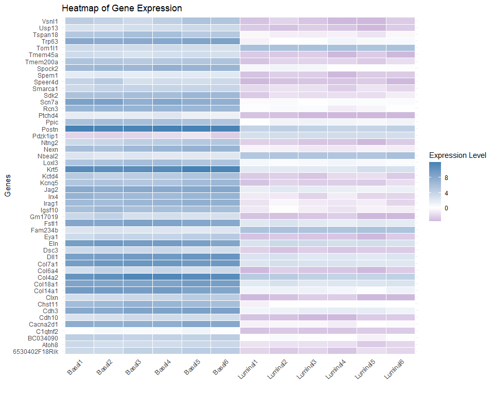

Bulk RNAseq Analysis in R+Rstudio
================
Ricardo A. DeMoya
6/20/2023

## Public data for practice

It can be very helpful to download a publications data (ex: fastq files)
and do your own analysis. By trying to recreate the figures or data they
have will confirm your ability to analyze the data like the pros do and
provide a starting point for your RNAseq analysis skill set.

## The data

There are so many publications to choose from it can be difficult to
know where to start. In this tutorial we are going to use a popular
mouse dataset for teaching R. Here we will only align to chromosome 1
and only map 1000 reads. This is because alignments of the entire genome
and all the reads is usually done on a larger cluster rather than
locally on a laptop or desktop. By cutting down the reference size and
number of reads to map we can provide a chance to do alignment on your
laptop and not wait for weeks to get output data for further study.

To access the data for this project download it all
[here](https://figshare.com/s/f5d63d8c265a05618137)

## First you have to download `Rsubread` from Bioconductor

Bioconductor has many biologically relevant tools for analysis of many
types of data. Explore the website and here is the link to `Rsubread`:
[Bioconductor
Rsubread](https://bioconductor.org/packages/release/bioc/html/Rsubread.html).
As said above the alignment is a computer intensive process. Normally
you would have to using a high performance computing resource to do the
alignment using any number of programs like `bowtie2`, `tophat`,
`hisat2`, or `subread`. The following code outlines the process of using
`Rsubread` for alignments. A whole genome alignment should not be done
on a local machine and you should be sure of the computational resources
available to you before performing an alignment.

## Next load the `Rsubread` and use `list.files()`

We can use `list.files()` to get the file names of all fastq files for
this project. They are stored in a directory named `./data`.

``` r
library(Rsubread)

fastq.files <- list.files(path = "./data", #list.files() is great for getting file names
                          pattern = ".fastq.gz$",# $ at the end means ending with this pattern
                          full.names = TRUE)
fastq.files # Double check the SRR files you have in the folder exist in this list
```

    ##  [1] "./data/SRR1552444.fastq.gz" "./data/SRR1552445.fastq.gz"
    ##  [3] "./data/SRR1552446.fastq.gz" "./data/SRR1552447.fastq.gz"
    ##  [5] "./data/SRR1552448.fastq.gz" "./data/SRR1552449.fastq.gz"
    ##  [7] "./data/SRR1552450.fastq.gz" "./data/SRR1552451.fastq.gz"
    ##  [9] "./data/SRR1552452.fastq.gz" "./data/SRR1552453.fastq.gz"
    ## [11] "./data/SRR1552454.fastq.gz" "./data/SRR1552455.fastq.gz"

## The Alignment with `Rsubread`

## Building the index for mouse chromosome 1

This tutorial has already supplied the index files and therefore we do
not need to build one. But the line of code below provides an example of
what building the index would entail.

``` r
# You don't need to run this code, index files are provided
buildindex(basename = "chr1_mm10",reference = "chr1.fa") # chr1.fa should be the mouse chromosome 1 refseq
```

This will save the index files in the current working directory when
run.

## Aligning reads to Ch1 of the mouse reference genome

After generating the index files for your reference genome, you can move
on to mapping 1000 reads. The mouse data has 100bp single end reads, but
if using paired end reads the `readfile2` parameter would be used. We
can specify the output files, or we can let `Rsubread` choose the output
file names for us. The default output file name is the file name with
.subread.BAM added at the end. Making it very easy to find them again
with `list.files()`

### Quick note on getting help in R

You can always type a `?` in front of a function and learn about it. For
example `??align()` will take you to the manual page for this function.
You can also see how many arguments a function has by running `args()`

``` r
?align # Should automatically reveal the manual in the help tab
```

``` r
args(align) # Prints out the arguments for a function and their default settings
```

    ## function (index, readfile1, readfile2 = NULL, type = "rna", input_format = "gzFASTQ", 
    ##     output_format = "BAM", output_file = paste(readfile1, "subread", 
    ##         output_format, sep = "."), phredOffset = 33, nsubreads = 10, 
    ##     TH1 = 3, TH2 = 1, maxMismatches = 3, unique = FALSE, nBestLocations = 1, 
    ##     indels = 5, complexIndels = FALSE, nTrim5 = 0, nTrim3 = 0, 
    ##     minFragLength = 50, maxFragLength = 600, PE_orientation = "fr", 
    ##     nthreads = 1, readGroupID = NULL, readGroup = NULL, keepReadOrder = FALSE, 
    ##     sortReadsByCoordinates = FALSE, color2base = FALSE, DP_GapOpenPenalty = -1, 
    ##     DP_GapExtPenalty = 0, DP_MismatchPenalty = 0, DP_MatchScore = 2, 
    ##     detectSV = FALSE, useAnnotation = FALSE, annot.inbuilt = "mm39", 
    ##     annot.ext = NULL, isGTF = FALSE, GTF.featureType = "exon", 
    ##     GTF.attrType = "gene_id", chrAliases = NULL) 
    ## NULL

## The `align()` function for aligning 1000 reads to mouse Ch1

The data provided has already been clipped to only 1000 reads and is
ready for processing. This will take a little time as alignment of all
twelve samples is done for chromosome 1.

``` r
Rsubread::align(index = "./data/chr1_mm10",readfile1 = fastq.files)
```

## Checking read quality

It is good practice to check the quality scores for your fastq files.
Here we only show the scores for one file but you should do so for each
file and confirm they meet your desired cutoff value.

``` r
qs <- qualityScores(filename = "./data/SRR1552450.fastq.gz", nreads = 1000)
```

    ## 
    ## qualityScores Rsubread 2.22.1
    ## 
    ## Scan the input file...
    ## Totally 1000 reads were scanned; the sampling interval is 1.
    ## Now extract read quality information...
    ## 
    ## Completed successfully. Quality scores for 1000 reads (equally spaced in the file) are returned.

``` r
dim(qs)
```

    ## [1] 1000  100

### A histogram can show the distribution of quality scores

A quality score of 30 means a 1 in 1000 chance of an incorrect base call
and a lower quality score reflects higher chance of erroneous base
calls, so 30 is a good cutoff value. A quick histogram allows us to see
where most quality scores are in the fastq file.

``` r
hist(qs)
```

<!-- -->

Overall these reads in sample SRR1552450 are of high quality. Once you
check the rest of the files you should be OK to move onto counting the
reads per gene and getting a count matrix. Another excellent tool to
check these files before using R, is
[FastQC](https://www.bioinformatics.babraham.ac.uk/projects/fastqc/)
from Babraham Bioinformatics.

## Counting reads per gene

First we need to get the file names of the BAM files created by the
`align()` function.

``` r
bam.files <- list.files(path = "./data", pattern = ".BAM$", full.names = TRUE)
bam.files
```

    ##  [1] "./data/SRR1552444.fastq.gz.subread.BAM"
    ##  [2] "./data/SRR1552445.fastq.gz.subread.BAM"
    ##  [3] "./data/SRR1552446.fastq.gz.subread.BAM"
    ##  [4] "./data/SRR1552447.fastq.gz.subread.BAM"
    ##  [5] "./data/SRR1552448.fastq.gz.subread.BAM"
    ##  [6] "./data/SRR1552449.fastq.gz.subread.BAM"
    ##  [7] "./data/SRR1552450.fastq.gz.subread.BAM"
    ##  [8] "./data/SRR1552451.fastq.gz.subread.BAM"
    ##  [9] "./data/SRR1552452.fastq.gz.subread.BAM"
    ## [10] "./data/SRR1552453.fastq.gz.subread.BAM"
    ## [11] "./data/SRR1552454.fastq.gz.subread.BAM"
    ## [12] "./data/SRR1552455.fastq.gz.subread.BAM"

We can produce a summary of the proportion of reads mapped by using
`propmapped()` on the BAM files. Remember we only mapped 1000 total
reads (NumTotal) to chromosome 1, which is why we see such low
proportions mapped in the PropMapped column. In normal analyses you
would want to see higher proportion mapped to your reference.

``` r
props <- propmapped(files = bam.files)
props
```

    ##                                 NumTotal NumMapped PropMapped
    ## SRR1552444.fastq.gz.subread.BAM     1000       145      0.145
    ## SRR1552445.fastq.gz.subread.BAM     1000       136      0.136
    ## SRR1552446.fastq.gz.subread.BAM     1000       120      0.120
    ## SRR1552447.fastq.gz.subread.BAM     1000       113      0.113
    ## SRR1552448.fastq.gz.subread.BAM     1000        55      0.055
    ## SRR1552449.fastq.gz.subread.BAM     1000        76      0.076
    ## SRR1552450.fastq.gz.subread.BAM     1000       124      0.124
    ## SRR1552451.fastq.gz.subread.BAM     1000       160      0.160
    ## SRR1552452.fastq.gz.subread.BAM     1000       142      0.142
    ## SRR1552453.fastq.gz.subread.BAM     1000       151      0.151
    ## SRR1552454.fastq.gz.subread.BAM     1000       133      0.133
    ## SRR1552455.fastq.gz.subread.BAM     1000       116      0.116

## The count matrix

Using `featureCounts()` we add up the reads per genomic loci (per gene)
and output a count matrix we can used for further analysis in `edgeR`.
This function has some built in annotations for mouse (mm9 and mm10), so
we can use this here, but an annotation file will be provided by the
user if the built-in annotations do not meet your needs.

``` r
fc <- featureCounts(bam.files,annot.inbuilt = "mm10")
```

### Inspect `featureCount()` output data

``` r
names(fc)
```

    ## [1] "counts"     "annotation" "targets"    "stat"

Counts are the number of reads, annotation are chromosome coordinates,
targets contains sample info, and the stat will contain stats on the
unassigned reads and what category they fall into. Let’s check out the
stats.

``` r
fc$stat
```

    ##                           Status SRR1552444.fastq.gz.subread.BAM
    ## 1                       Assigned                              50
    ## 2            Unassigned_Unmapped                             855
    ## 3           Unassigned_Read_Type                               0
    ## 4           Unassigned_Singleton                               0
    ## 5      Unassigned_MappingQuality                               0
    ## 6             Unassigned_Chimera                               0
    ## 7      Unassigned_FragmentLength                               0
    ## 8           Unassigned_Duplicate                               0
    ## 9        Unassigned_MultiMapping                               0
    ## 10          Unassigned_Secondary                               0
    ## 11           Unassigned_NonSplit                               0
    ## 12         Unassigned_NoFeatures                              95
    ## 13 Unassigned_Overlapping_Length                               0
    ## 14          Unassigned_Ambiguity                               0
    ##    SRR1552445.fastq.gz.subread.BAM SRR1552446.fastq.gz.subread.BAM
    ## 1                               45                              34
    ## 2                              864                             880
    ## 3                                0                               0
    ## 4                                0                               0
    ## 5                                0                               0
    ## 6                                0                               0
    ## 7                                0                               0
    ## 8                                0                               0
    ## 9                                0                               0
    ## 10                               0                               0
    ## 11                               0                               0
    ## 12                              90                              86
    ## 13                               0                               0
    ## 14                               1                               0
    ##    SRR1552447.fastq.gz.subread.BAM SRR1552448.fastq.gz.subread.BAM
    ## 1                               34                              13
    ## 2                              887                             945
    ## 3                                0                               0
    ## 4                                0                               0
    ## 5                                0                               0
    ## 6                                0                               0
    ## 7                                0                               0
    ## 8                                0                               0
    ## 9                                0                               0
    ## 10                               0                               0
    ## 11                               0                               0
    ## 12                              79                              41
    ## 13                               0                               0
    ## 14                               0                               1
    ##    SRR1552449.fastq.gz.subread.BAM SRR1552450.fastq.gz.subread.BAM
    ## 1                               21                              50
    ## 2                              924                             876
    ## 3                                0                               0
    ## 4                                0                               0
    ## 5                                0                               0
    ## 6                                0                               0
    ## 7                                0                               0
    ## 8                                0                               0
    ## 9                                0                               0
    ## 10                               0                               0
    ## 11                               0                               0
    ## 12                              55                              73
    ## 13                               0                               0
    ## 14                               0                               1
    ##    SRR1552451.fastq.gz.subread.BAM SRR1552452.fastq.gz.subread.BAM
    ## 1                               69                              50
    ## 2                              840                             858
    ## 3                                0                               0
    ## 4                                0                               0
    ## 5                                0                               0
    ## 6                                0                               0
    ## 7                                0                               0
    ## 8                                0                               0
    ## 9                                0                               0
    ## 10                               0                               0
    ## 11                               0                               0
    ## 12                              91                              90
    ## 13                               0                               0
    ## 14                               0                               2
    ##    SRR1552453.fastq.gz.subread.BAM SRR1552454.fastq.gz.subread.BAM
    ## 1                               53                              55
    ## 2                              849                             867
    ## 3                                0                               0
    ## 4                                0                               0
    ## 5                                0                               0
    ## 6                                0                               0
    ## 7                                0                               0
    ## 8                                0                               0
    ## 9                                0                               0
    ## 10                               0                               0
    ## 11                               0                               0
    ## 12                              97                              78
    ## 13                               0                               0
    ## 14                               1                               0
    ##    SRR1552455.fastq.gz.subread.BAM
    ## 1                               42
    ## 2                              884
    ## 3                                0
    ## 4                                0
    ## 5                                0
    ## 6                                0
    ## 7                                0
    ## 8                                0
    ## 9                                0
    ## 10                               0
    ## 11                               0
    ## 12                              74
    ## 13                               0
    ## 14                               0

Don’t worry we know why most reads do not map in this case, most reads
are not from chromosome 1.

### Next let’s inspect the count data

``` r
dim(fc$counts) # Number of rows tells us the number of genes 
```

    ## [1] 27179    12

``` r
head(fc$counts,n = 5) # Shows the first 5 entries
```

    ##           SRR1552444.fastq.gz.subread.BAM SRR1552445.fastq.gz.subread.BAM
    ## 497097                                  0                               0
    ## 100503874                               0                               0
    ## 100038431                               0                               0
    ## 19888                                   0                               0
    ## 20671                                   0                               0
    ##           SRR1552446.fastq.gz.subread.BAM SRR1552447.fastq.gz.subread.BAM
    ## 497097                                  0                               0
    ## 100503874                               0                               0
    ## 100038431                               0                               0
    ## 19888                                   0                               0
    ## 20671                                   0                               0
    ##           SRR1552448.fastq.gz.subread.BAM SRR1552449.fastq.gz.subread.BAM
    ## 497097                                  0                               0
    ## 100503874                               0                               0
    ## 100038431                               0                               0
    ## 19888                                   0                               0
    ## 20671                                   0                               0
    ##           SRR1552450.fastq.gz.subread.BAM SRR1552451.fastq.gz.subread.BAM
    ## 497097                                  0                               0
    ## 100503874                               0                               0
    ## 100038431                               0                               0
    ## 19888                                   0                               0
    ## 20671                                   0                               0
    ##           SRR1552452.fastq.gz.subread.BAM SRR1552453.fastq.gz.subread.BAM
    ## 497097                                  0                               0
    ## 100503874                               0                               0
    ## 100038431                               0                               0
    ## 19888                                   0                               0
    ## 20671                                   0                               0
    ##           SRR1552454.fastq.gz.subread.BAM SRR1552455.fastq.gz.subread.BAM
    ## 497097                                  0                               0
    ## 100503874                               0                               0
    ## 100038431                               0                               0
    ## 19888                                   0                               0
    ## 20671                                   0                               0

### Now the annotation data

This should explain the annotation information `featureCounts()` used to
summarize reads over genes

``` r
head(fc$annotation, n = 5)
```

    ##      GeneID                           Chr
    ## 1    497097                chr1;chr1;chr1
    ## 2 100503874                     chr1;chr1
    ## 3 100038431                          chr1
    ## 4     19888 chr1;chr1;chr1;chr1;chr1;chr1
    ## 5     20671      chr1;chr1;chr1;chr1;chr1
    ##                                             Start
    ## 1                         3214482;3421702;3670552
    ## 2                                 3647309;3658847
    ## 3                                         3680155
    ## 4 4290846;4343507;4351910;4352202;4360200;4409170
    ## 5         4490928;4493100;4493772;4495136;4496291
    ##                                               End      Strand Length
    ## 1                         3216968;3421901;3671498       -;-;-   3634
    ## 2                                 3650509;3658904         -;-   3259
    ## 3                                         3681788           +   1634
    ## 4 4293012;4350091;4352081;4352837;4360314;4409241 -;-;-;-;-;-   9747
    ## 5         4492668;4493466;4493863;4495942;4496413   -;-;-;-;-   3130

## `edgeR` and RNAseq anaylsis with a count matrix

The `edgeR` package is a versatile package generated to facilitate
RNAseq analysis. In some cases you will be provided a count matrix and
will enter the file in directly used `read.table()` or `read.csv()`.
This is because the alignment is normally done on a large cluster
instead of locally, which would be too computationally intensive. Since
we only mapped 1000 reads for only chromosome 1 we circumvented that
problem. Let’s use `edgeR` to analyze our count matrix data.

First we need to isolate just the count matrix from the `fc` lists of
lists data structure.

``` r
# Make your count matrix into a dataframe
countMatrix <- data.frame(fc$counts) # keeps rows as genes and columns as samples
colSums(countMatrix) # But remember we have very low count numbers
```

    ## SRR1552444.fastq.gz.subread.BAM SRR1552445.fastq.gz.subread.BAM 
    ##                              50                              45 
    ## SRR1552446.fastq.gz.subread.BAM SRR1552447.fastq.gz.subread.BAM 
    ##                              34                              34 
    ## SRR1552448.fastq.gz.subread.BAM SRR1552449.fastq.gz.subread.BAM 
    ##                              13                              21 
    ## SRR1552450.fastq.gz.subread.BAM SRR1552451.fastq.gz.subread.BAM 
    ##                              50                              69 
    ## SRR1552452.fastq.gz.subread.BAM SRR1552453.fastq.gz.subread.BAM 
    ##                              50                              53 
    ## SRR1552454.fastq.gz.subread.BAM SRR1552455.fastq.gz.subread.BAM 
    ##                              55                              42

### It might be more fun to investigate their published count matrix

The count matrix we made is fine but will be very empty for downstream
analyses. The count matrix from the actual paper will provide more
interesting plotting and investigation with `edgeR`. You can find the
count matrix
[here](https://www.ncbi.nlm.nih.gov/geo/query/acc.cgi?acc=GSE60450). The
`head()` function previews the data for us.

``` r
dat <- read.delim(file = "./data/GSE60450_Lactation-GenewiseCounts.txt",header = T,sep = "\t",dec = ".")
head(dat)
```

    ##   EntrezGeneID Length MCL1.DG_BC2CTUACXX_ACTTGA_L002_R1
    ## 1       497097   3634                               438
    ## 2    100503874   3259                                 1
    ## 3    100038431   1634                                 0
    ## 4        19888   9747                                 1
    ## 5        20671   3130                               106
    ## 6        27395   4203                               309
    ##   MCL1.DH_BC2CTUACXX_CAGATC_L002_R1 MCL1.DI_BC2CTUACXX_ACAGTG_L002_R1
    ## 1                               300                                65
    ## 2                                 0                                 1
    ## 3                                 0                                 0
    ## 4                                 1                                 0
    ## 5                               182                                82
    ## 6                               234                               337
    ##   MCL1.DJ_BC2CTUACXX_CGATGT_L002_R1 MCL1.DK_BC2CTUACXX_TTAGGC_L002_R1
    ## 1                               237                               354
    ## 2                                 1                                 0
    ## 3                                 0                                 0
    ## 4                                 0                                 0
    ## 5                               105                                43
    ## 6                               300                               290
    ##   MCL1.DL_BC2CTUACXX_ATCACG_L002_R1 MCL1.LA_BC2CTUACXX_GATCAG_L001_R1
    ## 1                               287                                 0
    ## 2                                 4                                 0
    ## 3                                 0                                 0
    ## 4                                 0                                10
    ## 5                                82                                16
    ## 6                               270                               560
    ##   MCL1.LB_BC2CTUACXX_TGACCA_L001_R1 MCL1.LC_BC2CTUACXX_GCCAAT_L001_R1
    ## 1                                 0                                 0
    ## 2                                 0                                 0
    ## 3                                 0                                 0
    ## 4                                 3                                10
    ## 5                                25                                18
    ## 6                               464                               489
    ##   MCL1.LD_BC2CTUACXX_GGCTAC_L001_R1 MCL1.LE_BC2CTUACXX_TAGCTT_L001_R1
    ## 1                                 0                                 0
    ## 2                                 0                                 0
    ## 3                                 0                                 0
    ## 4                                 2                                 0
    ## 5                                 8                                 3
    ## 6                               328                               307
    ##   MCL1.LF_BC2CTUACXX_CTTGTA_L001_R1
    ## 1                                 0
    ## 2                                 0
    ## 3                                 0
    ## 4                                 0
    ## 5                                10
    ## 6                               342

Next make a data frame that will only have row names as gene names and
column names as the sample names assigned by the authors, removing the
`Length` and `EntrezGeneID` columns.

``` r
dat_Mus <- data.frame(dat[3:ncol(dat)], row.names = dat$EntrezGeneID)
```

### This is much better than the data we mapped to chromosome one

``` r
head(dat_Mus, n = 5) # Check out the data
```

    ##           MCL1.DG_BC2CTUACXX_ACTTGA_L002_R1 MCL1.DH_BC2CTUACXX_CAGATC_L002_R1
    ## 497097                                  438                               300
    ## 100503874                                 1                                 0
    ## 100038431                                 0                                 0
    ## 19888                                     1                                 1
    ## 20671                                   106                               182
    ##           MCL1.DI_BC2CTUACXX_ACAGTG_L002_R1 MCL1.DJ_BC2CTUACXX_CGATGT_L002_R1
    ## 497097                                   65                               237
    ## 100503874                                 1                                 1
    ## 100038431                                 0                                 0
    ## 19888                                     0                                 0
    ## 20671                                    82                               105
    ##           MCL1.DK_BC2CTUACXX_TTAGGC_L002_R1 MCL1.DL_BC2CTUACXX_ATCACG_L002_R1
    ## 497097                                  354                               287
    ## 100503874                                 0                                 4
    ## 100038431                                 0                                 0
    ## 19888                                     0                                 0
    ## 20671                                    43                                82
    ##           MCL1.LA_BC2CTUACXX_GATCAG_L001_R1 MCL1.LB_BC2CTUACXX_TGACCA_L001_R1
    ## 497097                                    0                                 0
    ## 100503874                                 0                                 0
    ## 100038431                                 0                                 0
    ## 19888                                    10                                 3
    ## 20671                                    16                                25
    ##           MCL1.LC_BC2CTUACXX_GCCAAT_L001_R1 MCL1.LD_BC2CTUACXX_GGCTAC_L001_R1
    ## 497097                                    0                                 0
    ## 100503874                                 0                                 0
    ## 100038431                                 0                                 0
    ## 19888                                    10                                 2
    ## 20671                                    18                                 8
    ##           MCL1.LE_BC2CTUACXX_TAGCTT_L001_R1 MCL1.LF_BC2CTUACXX_CTTGTA_L001_R1
    ## 497097                                    0                                 0
    ## 100503874                                 0                                 0
    ## 100038431                                 0                                 0
    ## 19888                                     0                                 0
    ## 20671                                     3                                10

### The original paper mapped ~20 million reads per sample

``` r
colSums(dat_Mus) # The mapped reads from the paper provide ~20 million counts per sample
```

    ## MCL1.DG_BC2CTUACXX_ACTTGA_L002_R1 MCL1.DH_BC2CTUACXX_CAGATC_L002_R1 
    ##                          23227641                          21777891 
    ## MCL1.DI_BC2CTUACXX_ACAGTG_L002_R1 MCL1.DJ_BC2CTUACXX_CGATGT_L002_R1 
    ##                          24100765                          22665371 
    ## MCL1.DK_BC2CTUACXX_TTAGGC_L002_R1 MCL1.DL_BC2CTUACXX_ATCACG_L002_R1 
    ##                          21529331                          20015386 
    ## MCL1.LA_BC2CTUACXX_GATCAG_L001_R1 MCL1.LB_BC2CTUACXX_TGACCA_L001_R1 
    ##                          20392113                          21708152 
    ## MCL1.LC_BC2CTUACXX_GCCAAT_L001_R1 MCL1.LD_BC2CTUACXX_GGCTAC_L001_R1 
    ##                          22241607                          21988240 
    ## MCL1.LE_BC2CTUACXX_TAGCTT_L001_R1 MCL1.LF_BC2CTUACXX_CTTGTA_L001_R1 
    ##                          24723827                          24657293

### Metadata

Next we should create a metadata table for these counts including
information like which group each sample belongs to, basal or luminal.
We will also include some helpful columns like Colors and Shapes which
will assist in consistent plotting throughout the figures made for this
project.

``` r
meta <- data.frame(row.names = colnames(dat_Mus), stringsAsFactors = T)

meta$Groups <- factor(c(rep("Basal", 6), rep("Luminal", 6)),
                      levels = c("Basal","Luminal"))

meta$Colors <- c(rep("blue", 6), rep("green", 6))
meta$Shapes <- c(rep("19", 6), rep("17", 6))
```

### Load `edgeR` package

The `edgeR` package contains the functions we will use for analysis. If
you do not have it installed you should search for it on
[Bioconductor](https://bioconductor.org/).

``` r
#Get the libraries for analysis
library("edgeR")
```

### We will make a `DGEList` object

We need a `DGEList` object for downstream analysis and we will also
change the column names to something more easily understood.

``` r
y = DGEList(counts=dat_Mus, genes=row.names(dat_Mus),samples = meta, group = meta$Groups)
colnames(y) <- c("Basal1","Basal2","Basal3","Basal4","Basal5","Basal6",
                 "Luminal1","Luminal2","Luminal3","Luminal4","Luminal5","Luminal6")
```

### Filter lowly expressed genes

``` r
keep <- filterByExpr(y,group = y$samples$Groups)
y <- y[keep, , keep.lib.sizes=F]
```

### Normalize the data

``` r
y <- calcNormFactors(y, method = "TMM") # Trimmed Mean of M-values (TMM)
```

### Create a design matrix to compare Basal and Luminal

``` r
# Next is the design matrix used to provide info on the samples
design_matrix <- model.matrix(~meta$Groups)
rownames(design_matrix) <- rownames(meta)
colnames(design_matrix) <- c('Basal', 'Luminal')


# The basal data is the intercept for comparison to the luminal groups
design_matrix
```

    ##                                   Basal Luminal
    ## MCL1.DG_BC2CTUACXX_ACTTGA_L002_R1     1       0
    ## MCL1.DH_BC2CTUACXX_CAGATC_L002_R1     1       0
    ## MCL1.DI_BC2CTUACXX_ACAGTG_L002_R1     1       0
    ## MCL1.DJ_BC2CTUACXX_CGATGT_L002_R1     1       0
    ## MCL1.DK_BC2CTUACXX_TTAGGC_L002_R1     1       0
    ## MCL1.DL_BC2CTUACXX_ATCACG_L002_R1     1       0
    ## MCL1.LA_BC2CTUACXX_GATCAG_L001_R1     1       1
    ## MCL1.LB_BC2CTUACXX_TGACCA_L001_R1     1       1
    ## MCL1.LC_BC2CTUACXX_GCCAAT_L001_R1     1       1
    ## MCL1.LD_BC2CTUACXX_GGCTAC_L001_R1     1       1
    ## MCL1.LE_BC2CTUACXX_TAGCTT_L001_R1     1       1
    ## MCL1.LF_BC2CTUACXX_CTTGTA_L001_R1     1       1
    ## attr(,"assign")
    ## [1] 0 1
    ## attr(,"contrasts")
    ## attr(,"contrasts")$`meta$Groups`
    ## [1] "contr.treatment"

### Estimate the dispersions

``` r
# Estimate dispersions
# Common dispersion = the mean dispersion across all genes
y = estimateGLMCommonDisp(y,design_matrix,verbose = T)
```

    ## Disp = 0.17314 , BCV = 0.4161

``` r
# Trended dispersion = the mean dispersion across all genes with similar abundances
# In other words, the fitted value of the mean-dispersion trend.
y = estimateGLMTrendedDisp(y,design_matrix)

# Tagwise dispersion = the gene specific dispersions, so across samples
y = estimateGLMTagwiseDisp(y,design_matrix)
```

### Plotting the biological coefficient of variation for Basal vs Luminal samples

This allows for visualization of the biological variance you wish to
study. It represents the covariate of variation that would remain
between biological replicates if sequencing depth could be increased
indefinitely. For human cancer RNAseq data a BCV around 0.40 is common
but with isogeneic mouse lines this drops to 0.10, anything around these
values is a reasonable dataset to explore further.

``` r
# Make a variable to hold the Biological coefficient of variation (BCV)
bcv <- sqrt(as.numeric(y[["common.dispersion"]]))

# plots the tagwise biological coefficient of variation (square root of dispersions)
# against log2-CPM 
plotBCV(y, xlab = "Average Log2CPM")
text(x = 11,y =0.4, labels = round(bcv, digits = 5))
```

<!-- -->

Here we see a higher BCV because of the different stages we ignored when
making our metadata table. This shows there are difference between the
basal and luminal samples.

### Now we fit the model using `glmQLFit()`

``` r
# Fit to the model comparing WTvsNVvsSV
fit_edger = edgeR::glmQLFit(y, design = design_matrix)
```

`glmQLFit()` uses the trended NB dispersion to fit a Generalized Linear
Model (GLM), and then estimates the Quasi-Likelihood (QL) dispersion
from the deviance. It doesn’t re-estimate the NB dispersion but instead
estimates an entirely different QL dispersion for each gene. In
contrast, `glmFit()` uses the tagwise NB dispersion to fit a GLM and
that’s it.

### Finally the analysis using `glmQFLTest()` and `topTags()` on the fitted data from the previous step

Here we will get the results table and also make a differentially
expressed genes (DEGs) list

``` r
# The analysis for Basal vs Luminal, 
edgeR.results_ql = as.data.frame(edgeR::topTags(
  edgeR::glmQLFTest(glmfit = fit_edger),n=nrow(dat_Mus)))

DEGs <- edgeR.results_ql[which(abs(edgeR.results_ql$logFC)>2 & edgeR.results_ql$FDR<0.05),]
```

# Basic RNAseq Plots to Explore the Data

## Volcano plot

### Libraries needed for volcano plot

``` r
# Libraries for plotting data
library('ggplot2')

# Load packages
suppressMessages(library('tidyverse'))
library('ggrepel')
```

### Data preparation for volcano plot

``` r
volcano_dat <- data.frame (GeneNames = rownames(edgeR.results_ql),
                             log2FC = edgeR.results_ql$logFC,
                             FDR = edgeR.results_ql$FDR)

rownames(volcano_dat) <- volcano_dat$GeneNames

# making a column that labels who is in which group for plotting
volcano_dat <- volcano_dat %>% 
  mutate(
    Significance = case_when(
      abs(log2FC) >= 2 & FDR < 0.05 ~ "log2FC & FDR", 
      abs(log2FC) <= 2 & FDR < 0.05 ~ "FDR",
      abs(log2FC) >= 2 & FDR > 0.05 ~ "log2FC", 
      abs(log2FC) <= 2 & FDR > 0.05 ~ "NS")
  )
```

### We could convert the EnTrez IDs to gene names for plotting

This will take some time but will provide names we need for plotting. It
is also acceptable to do this after selecting genes for analysis.

``` r
library("mygene")
Entrez_IDs <- rownames(DEGs)
geneNames <- getGenes(Entrez_IDs,fields = c("symbol","name"))
```

``` r
head(geneNames,n=10)
```

    ## DataFrame with 10 rows and 6 columns
    ##          query         _id X_version                   name      symbol
    ##    <character> <character> <integer>            <character> <character>
    ## 1        13507       13507         2          desmocollin 3        Dsc3
    ## 2        50706       50706         1 periostin, osteoblas..       Postn
    ## 3        14048       14048         2 EYA transcriptional ..        Eya1
    ## 4        12836       12836         1 collagen, type VII, ..      Col7a1
    ## 5        16450       16450         2               jagged 2        Jag2
    ## 6        77220       77220         1 transmembrane protei..    Tmem200a
    ## 7        12293       12293         1 calcium channel, vol..    Cacna2d1
    ## 8       320873      320873         1            cadherin 10       Cdh10
    ## 9        72607       72607         2 ubiquitin specific p..       Usp13
    ## 10       14314       14314         2     follistatin-like 1       Fstl1
    ##     notfound
    ##    <logical>
    ## 1         NA
    ## 2         NA
    ## 3         NA
    ## 4         NA
    ## 5         NA
    ## 6         NA
    ## 7         NA
    ## 8         NA
    ## 9         NA
    ## 10        NA

### Set up the theme for the volcano plot

``` r
# Theme set up to control all elements
mi_teme <- ggplot2::theme(title = element_text(size = 14, face = "bold"),
                 plot.title.position = "panel",
                 plot.title = element_text(vjust =-2,hjust = 0.5),
                 axis.text.x = element_text(size= 10),
                 axis.text.y = element_text(size = 10),
                 axis.title.x = element_text(face = "bold",size = 12),
                 axis.title.y = element_text(face = "bold",size = 12),
                 legend.text = element_text(size = 10, face = "bold"),
                 legend.title = element_blank(),
                 legend.position = "top",
                 legend.spacing.x = unit(0.2,"picas"), 
                 legend.key = element_blank(),
                 legend.box.spacing = unit(0.001,"picas"),
                 legend.key.size = unit(0.001,"picas"),
                 plot.margin = unit(c(0.01,1,0.01,1),"mm"))
```

First we want to grab the gene names

``` r
# Make a list of desired genes to plot
s <- data.frame(geneNames[which(geneNames$query %in% volcano_dat$GeneNames),])
k <- data.frame(volcano_dat[which(volcano_dat$GeneNames %in% geneNames$query),])
b <- cbind(s,k)
b <- b[which(abs(b$log2FC)>=2 & b$FDR<0.05),]
b<- b[order(b$log2FC),]
d<- rbind(head(b,n=10),tail(b,n=10))
```

### Make a volcano plot to visualize all the data at once

Here we plot all the genes in one graph with cuts offs for FDR \< 0.05
and a log2FC \>= 2 or \<= -2.

``` r
# Make a ggplot volcano
volcanoMan <- ggplot(volcano_dat)+
  geom_point(aes(log2FC,-log(FDR,10),color=Significance),size = 1, alpha = 4/5)+
  scale_color_manual(values = c("NS"="darkgrey","log2FC & FDR"="seagreen","log2FC"="orangered3","FDR"="lightblue"))+
  xlab(bquote(~Log[2]~fold~change))+
  ylab(bquote(~-Log[10]~italic(FDR)))+
  geom_hline(yintercept = -log10(0.05))+
  geom_vline(xintercept = c(-2,2))+
  ggtitle(expression(bold("Basal")~bold("vs")~bold("Luminal")))+
  geom_label_repel(data = d,aes(log2FC,-log(FDR,10),label = symbol), size = 4, 
                  force = 0.5,direction = "both",max.overlaps = 20,
                  nudge_y = c(rep(0.35,5),rep(-.25,2),rep(0.35,3)),
                  arrow = arrow(length = unit(0.01, 'npc'),ends = "last",type = "closed"),
                  segment.color = 'black',segment.size = 0.4,
                  min.segment.length = 0, seed = 42, 
                  fontface = "bold.italic",label.padding = 0.1)+
  guides(color= guide_legend(reverse = TRUE, override.aes = list(size=5)))

volcanoMan + mi_teme
```

<!-- -->

## Heatmap

Prepare the data from the normalized count matrix and melt the data
together. The data from this publication was not perfect. First we
needed to calculate the counts per million values for the count matrix,
then using the `mygene` package we added the gene names for each Entrez
ID value. Then by removing all `NA` values and making all the gene names
unique we can melt the data together.

``` r
library("reshape2")

logCPM <- cpm(y, log=T)
deg_logCPM <- data.frame(logCPM[rownames(DEGs),])
geneN <- data.frame(geneNames[which(geneNames$query %in% rownames(deg_logCPM)),])
geneN$symbol <- make.unique(geneN$symbol)
combine_dat <- cbind(deg_logCPM,geneN$symbol)
combine_dat <- na.omit(combine_dat)
rownames(combine_dat) <- combine_dat$`geneN$symbol`
sub_comb <- combine_dat[1:50,]

melted <- melt(sub_comb)
colnames(melted) <- c("Genes","Sample","Expression")

heat <- ggplot(melted, aes(x = Sample, y = Genes, fill = Expression)) +
  geom_tile(color = "white") + # Add borders to tiles
  scale_fill_gradient2(low = "purple4",mid = "white", high = "steelblue") + # Adjust color scale
  theme_minimal() + # Use a minimal theme
  theme(axis.text.x = element_text(angle = 45, hjust = 1)) + # Rotate x-axis labels
  labs(title = "Heatmap of Gene Expression",
       x = "",
       y = "Genes",
       fill = "Expression Level")
heat
```

<!-- -->
