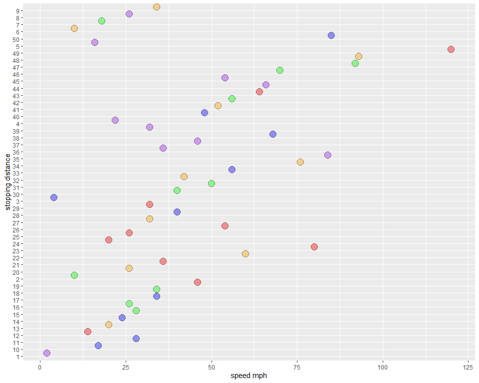
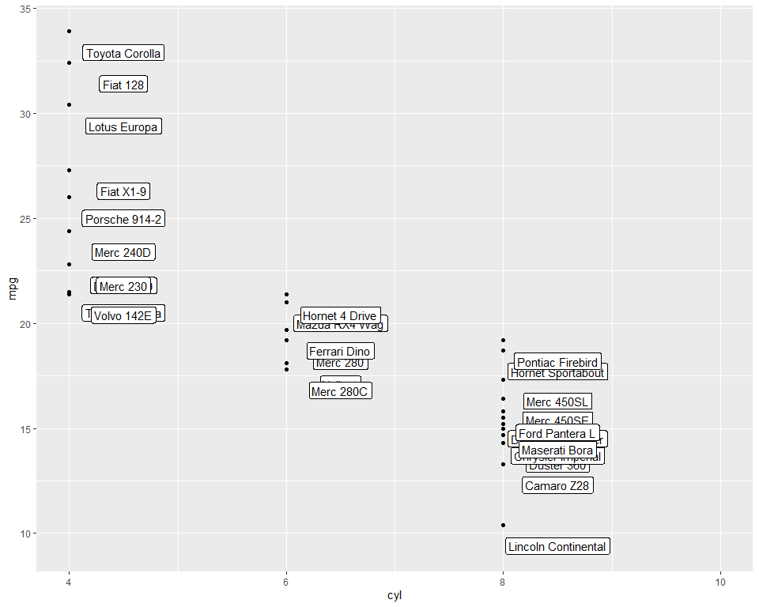
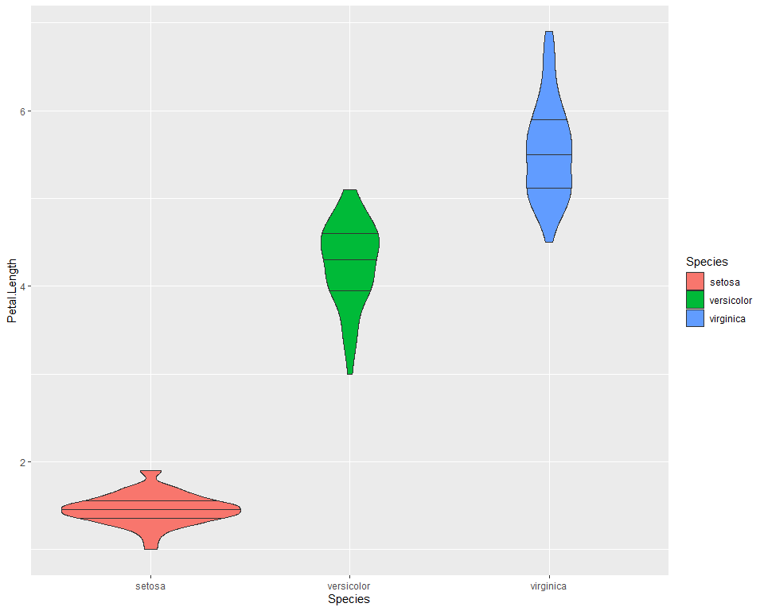

R programming language
================
Ricardo A. DeMoya
5/30/2025

# The R programming language basics

The R programming language is a free, open-source software environment,
used for statistical analysis and graphical representations. Originally
based on another language called “S”. This [GNU](https://www.gnu.org/)
is useful for many different processes and functions. I have used it for
things like RNAseq analysis, plotting of various data, and even for
making this tutorial! Here I hope to show you the beauty of the R
programming language and allow you to make use of this powerful free
tool.

## Getting help when you need it

The R programming language makes it very easy to query their
documentation and get information on packages very quickly.

``` r
help("datasets")
```

### Or use the “?”

``` r
?datasets # Opens in help tab
```

### or the “??” to search all

This will allow you to search through the R documentation files and see
everything you have under `append`

``` r
??append
```

If your query is more than one word be sure to encase it in quotations
like “Box plot”

``` r
??"Box plot"
```

## Directories

Directories are folders, or directory = folder. This is important to
remember because you must set your directory properly if you want your
code to access the right data. Using the New project option in Rstudio’s
file drop-down menu you can be sure that all code in that project will
pull data from only that directory/folder you assigned it to or create.
Check out my tutorial on RStudio for more on that.

``` r
getwd() # Print the working directory you are in
# "./Teaching_R_coding_tutorials"
```

Try this outside a project and then open a project and try again. You
will see that once the project is opened you are in the directory that
you placed the project in or created.

### Set the working directory however you like

If for some reason you need to access another directory you can always
access it by changing the working directory manually.

``` r
setwd("desired file path")
```

    ## Error in setwd("desired file path"): cannot change working directory

``` r
# An example setwd("./Documents/R_folder/Teaching_R_coding")
```

A quick note on errors in R. The above error is easy to interpret
because we don’t have a file path named “desired/file/path” right?
Sometimes error messages will not be so clear but a simple Google search
can help you find answers in most cases. The open community of R allows
you to figure out what is wrong with your code because chances are
someone else has tried what you are doing and either figured it out or
will tell you it is a dead end. Some great resource websites include
[stackoverflow](https://stackoverflow.com/) and
[ResearchGate](https://www.researchgate.net/)

## Uploading packages

As you use base R you will find that you want to use some of the special
tools made in R by others. These packages of R code allow for some
amazing plots and data analysis. The possibilities are nearly endless,
so let’s make sure you can upload and use packages outside of base R.

### Download and install packages

``` r
install.packages('ggplot2')
```

### Once downloaded they can be used

``` r
library("ggplot2")
```

# Simple math in base R

R has many functions built around mathematics. Simple functions like
`sum()`, will you guessed it sum things. Or `abs()` provides the
absolute value of a number. A list of the available base R math
functions can be found easily online. Here are just a couple to get you
started.

### Add or subtract something

This could be a column of numbers or a list of numbers, any vector given
to sum will be added together.

``` r
sum(c(3,5,6,20,15,24))
```

    ## [1] 73

But you can also use the “+” operator to add numbers and variables

``` r
# Raw numbers
3+5+6+20+15+24
```

    ## [1] 73

``` r
# Variables
x=5
y<-25
x+y
```

    ## [1] 30

And subtract them as well

``` r
1065-65
```

    ## [1] 1000

``` r
y-x
```

    ## [1] 20

### Summary statistics

These math functions allow you to get an overall look at the data
through simple summary statistics, like `mean()`, `max()`, `median()`,
`min()`, and `quantile()`. First we build a random data frame with
`rnorm()`

``` r
# Build a quick data.frame
dat <- rnorm(25)
head(dat,n=5)
```

    ## [1] -1.0209854  0.1094406 -0.5747229 -0.7989678 -0.1970525

Then we can check out the data quickly with `summary()`

``` r
# Check out some summary data
summary(dat)
```

    ##     Min.  1st Qu.   Median     Mean  3rd Qu.     Max. 
    ## -1.81925 -0.79897 -0.19705 -0.06969  0.44356  2.32096

# Built-in R datasets

For beginners R provide multiple data sets in the `datasets` package to
experiment with. Some online favorites are the `iris`, `mtcars`, and
`cars` data sets, because they provide fun categorical data and are
great for showing off the options R offers as a language, not only
statistical analysis, but visualization of those relationships as well.

## Check out that data!

Here we will just look at those three data sets.

``` r
data("cars")
data("mtcars")
data("iris")
```

### The `cars` dataset

This provides a 50x2 table with the speed of the cars (mph) and the
stopping distances (ft) measures back in the 1920s! To take a peak at
the data use the `head()` function and the n=5 parameter to get just the
top 5 entries of the data table.

``` r
head(cars, n=5)
```

    ##   speed dist
    ## 1     4    2
    ## 2     4   10
    ## 3     7    4
    ## 4     7   22
    ## 5     8   16

Let’s use the `summary()` function here.

``` r
summary(cars)
```

    ##      speed           dist       
    ##  Min.   : 4.0   Min.   :  2.00  
    ##  1st Qu.:12.0   1st Qu.: 26.00  
    ##  Median :15.0   Median : 36.00  
    ##  Mean   :15.4   Mean   : 42.98  
    ##  3rd Qu.:19.0   3rd Qu.: 56.00  
    ##  Max.   :25.0   Max.   :120.00

We can also look at the dimensions an confirm we have all the entries we
should.

``` r
dim(cars) # rows, cols
```

    ## [1] 50  2

Awesome we have the exact number of rows and columns expected.

Just a quick plot using ggplot2. Shows the different cars and their
stopping distance. But notice the numbers are a little mixed up as in R
this is considered alphabetical order. How to fix this will be covered
in another tutorial on `ggplot2`.

``` r
box_plot <- ggplot(cars, aes(x=dist,y=rownames(cars)))+
  geom_dotplot(fill=rep(c("purple","blue","green","orange","red"),10), alpha=0.4,binwidth = 2)+
  xlab("speed mph")+ylab("stopping distance")
box_plot
```

<!-- -->

### The `mtcars` dataset

This provides a 32x11 table with the fuel consumption and 10 aspects of
automobile design of 1974’s *Motor Trend* USA magazine! We will use the
`head()` function again to get a peek at the top 5 entries of the data
table. You can see the Datsun was a fuel efficient car in 1974.

``` r
head(mtcars, n=5)
```

    ##                    mpg cyl disp  hp drat    wt  qsec vs am gear carb
    ## Mazda RX4         21.0   6  160 110 3.90 2.620 16.46  0  1    4    4
    ## Mazda RX4 Wag     21.0   6  160 110 3.90 2.875 17.02  0  1    4    4
    ## Datsun 710        22.8   4  108  93 3.85 2.320 18.61  1  1    4    1
    ## Hornet 4 Drive    21.4   6  258 110 3.08 3.215 19.44  1  0    3    1
    ## Hornet Sportabout 18.7   8  360 175 3.15 3.440 17.02  0  0    3    2

There is also a `tail()` function that allows you to see the end of the
data. But wait looks like a more fuel efficient vehicle exists in the
data.

``` r
# Check out the last entries
tail(mtcars, n=5)
```

    ##                 mpg cyl  disp  hp drat    wt qsec vs am gear carb
    ## Lotus Europa   30.4   4  95.1 113 3.77 1.513 16.9  1  1    5    2
    ## Ford Pantera L 15.8   8 351.0 264 4.22 3.170 14.5  0  1    5    4
    ## Ferrari Dino   19.7   6 145.0 175 3.62 2.770 15.5  0  1    5    6
    ## Maserati Bora  15.0   8 301.0 335 3.54 3.570 14.6  0  1    5    8
    ## Volvo 142E     21.4   4 121.0 109 4.11 2.780 18.6  1  1    4    2

We should sort the data by mpg and see what car was the most efficient
in 1974.

``` r
mtcars_mpg <- mtcars[order(-mtcars$mpg),]
head(mtcars_mpg,n=5)
```

    ##                 mpg cyl disp  hp drat    wt  qsec vs am gear carb
    ## Toyota Corolla 33.9   4 71.1  65 4.22 1.835 19.90  1  1    4    1
    ## Fiat 128       32.4   4 78.7  66 4.08 2.200 19.47  1  1    4    1
    ## Honda Civic    30.4   4 75.7  52 4.93 1.615 18.52  1  1    4    2
    ## Lotus Europa   30.4   4 95.1 113 3.77 1.513 16.90  1  1    5    2
    ## Fiat X1-9      27.3   4 79.0  66 4.08 1.935 18.90  1  1    4    1

Next we can try to plot this data in a useful way. Maybe looking at the
mile per gallon (mpg) and the cylinders (cyl) per car would be
informative.

``` r
mtcars_mpgVscyl <- ggplot(mtcars, aes(x=cyl, y=mpg))+
  geom_point()+geom_label(label=rownames(mtcars),nudge_x = 0.5, nudge_y = -1)+
  xlim(4,10)
mtcars_mpgVscyl
```

<!-- -->

You can see the above labels are not great and could use some work to
make sure they do not overlap. I would look into `ggrepel` at this link.
You should be able to do this easily since the `ggrepel` package is a
CRAN package meaning it is easily accessible with `install.packages()`

### Finally the iris data set

This provides a 150x5 table with data on flower petal structures,
separated by species. Great data set to practice conditional slicing and
plotting data among groups greater than two.

``` r
tail(iris, n=5)
```

    ##     Sepal.Length Sepal.Width Petal.Length Petal.Width   Species
    ## 146          6.7         3.0          5.2         2.3 virginica
    ## 147          6.3         2.5          5.0         1.9 virginica
    ## 148          6.5         3.0          5.2         2.0 virginica
    ## 149          6.2         3.4          5.4         2.3 virginica
    ## 150          5.9         3.0          5.1         1.8 virginica

We can use the `summary()` and `dim()` functions to check the iris data
set

``` r
summary(iris)
```

    ##   Sepal.Length    Sepal.Width     Petal.Length    Petal.Width   
    ##  Min.   :4.300   Min.   :2.000   Min.   :1.000   Min.   :0.100  
    ##  1st Qu.:5.100   1st Qu.:2.800   1st Qu.:1.600   1st Qu.:0.300  
    ##  Median :5.800   Median :3.000   Median :4.350   Median :1.300  
    ##  Mean   :5.843   Mean   :3.057   Mean   :3.758   Mean   :1.199  
    ##  3rd Qu.:6.400   3rd Qu.:3.300   3rd Qu.:5.100   3rd Qu.:1.800  
    ##  Max.   :7.900   Max.   :4.400   Max.   :6.900   Max.   :2.500  
    ##        Species  
    ##  setosa    :50  
    ##  versicolor:50  
    ##  virginica :50  
    ##                 
    ##                 
    ## 

``` r
dim(iris)
```

    ## [1] 150   5

We can look at a quick violin plot on petal length per species

``` r
violin_plot <- ggplot(iris, aes(x=Species, y=Petal.Length))+
  geom_violin(draw_quantiles = c(0.25, 0.5, 0.75), aes(fill=Species))
violin_plot
```

<!-- -->

# Final remarks

Keep coding and practicing different things. Getting comfortable with
base R like any language will make your life easier in the future and
provide you more direct ways of solving problems instead of downloading
a million packages. Here we only cover the very basics of getting
started This is just the tip of the iceberg, if you want to get coding
and learn the R programming language I suggest reaching out to me by
email: <demoya.r12@gmail.com> or visit my github page
<https://github.com/rdemoya12/Teaching_R>.
